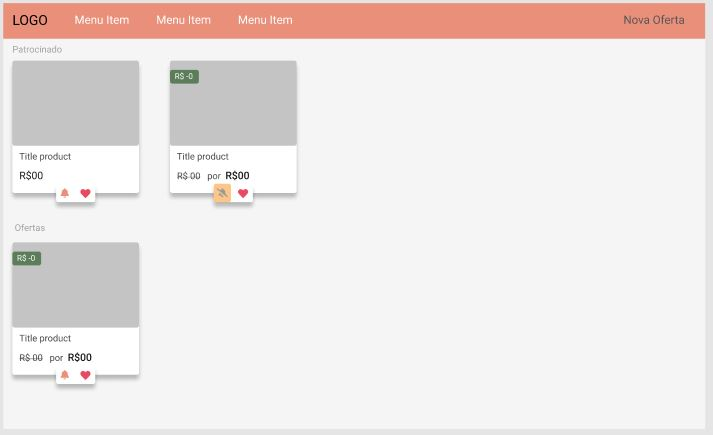

# Vitrine VueJS
Developed as technical test for a job interview.
## Dependecies
- NPM/Yarn 
- Git

## Installation
Run these shell commands 
```shell
git clone https://github.com/minasvisual/technical-test-vitrine-vuejs
```
```shell
cd technical-test-vitrine-vuejs
```
```shell
npm install
```
Run Vue project
```shell
npm run serve
```
In Other shell instance, in the same folder, run database JSON Server
```shell
npx json-server --watch db.json
```
Json server api will run on localhost:3000

Open web browser and navigato to [http://localhost:8080]
Enjoy!

# Instructions
- Json Server Docs [https://www.npmjs.com/package/json-server]
- To Insert new Ofertas, navigate to "Nova Oferta" and fill the form, after press Salvar button.

# About Job
 - Foi usado uma paleta de cores personalizada da Color Hunt, em tons pasteis para suavizar o contraste de imagens e focar a atenção do usuario nas ofertas.
- Para uma boa navegação e manter o clean type, foram usados icones da FontAwesome que mantem a experiência do usuário intuitiva e rápida, com base nos maiores players como youtube, facebook.
- 
